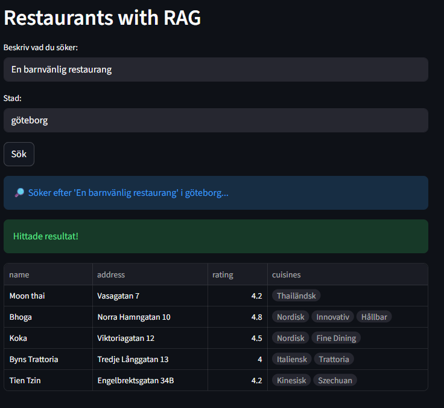

# RAG Agent: 
---

Strukturerad Dataextraktion (LanceDB + Gemini)

Detta projekt demonstrerar en robust **Retrieval-Augmented Generation** (RAG)-pipeline. 
Syftet är att hämta, indexera och strukturerat extrahera information från en lokal databas med ostrukturerade textbeskrivningar om restauranger i Göteborg och Uddevalla.

Projektet omvandlar ostrukturerad text (som beskrivningar och recensioner) till maskinläsbar JSON genom att använda en stor språkmodell (Gemeni) tvingad till ett specifikt schema.

Med denna struktur kan man själv fylla på med restaurangbesök, recensera för att sedan emd hjälp av LLM få ut datan för adress, rate osv.

# TODO:
- [x] Lägga till recensioner för restauranger i terminalen
- [x] Lägga till recensioner för restauranger i streamlit
- [x] Gå via fastapi till frontend i streamlit
- [x] Om adress inte nämns i den råa textinputen, guida llm att hitta adressen på nätet
- [x] Visa info om vald restaurang i streamlit 
- [x] Ändra så att LLM läger större vikt vid typ av mat/land
- [ ] Gör en snygg design
- [x] Skapa funktion för att ändra restaurang
- [x] Lägg in en slider för betygsskalan när man lägger till/ändrar restaurang

# STEG
- Retriaval/Hämta/Lägg till: Vektorinbäddningar, jag använder embedding_model.encode() för att göra data sökbar i LanceDB.
- Augmentering: Använder explicit etikettering i perform_vector_search() för att förhindra hallucinationer.
- Generering: Response_schema=RestaurantList tvingar Gemini att svara i ett strukturerat format och att model_validate_json() validerar det svaret.

- Streamlit frågar FastAPI, som frågar LanceDB för kontext, som skickas till Gemini, vars svar Pydantic validerar, och slutligen skickas det strukturerade svaret tillbaka till Streamlit för visning.

---

